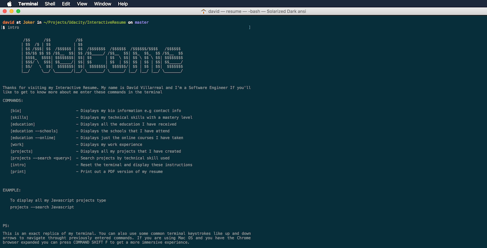

# Interactive Resume / Portfolio Website
This repo contains my Interactive Resume website. It is purely a frontend project that is built with ReactJS. It does however use [GitHub GraphQL API](https://developer.github.com/v4/) to get information about my repositories. Using Github's API means that the website will be up to date with all my current repositories. You can view the live version [here](https://phaze1d.github.io/Interactive-Resume/)

> This is a screenshot of the actual website not a screenshot of a terminal window

## Development
You can easily modify a bit of the code to display anyone's Github information if there profile and repositories are public but remember that not all of the information comes from Github. For example, the bio, education, work, skills, and PDF Resume will have to be changed manually.

To get started with development just follow this steps.

1. Fork or Clone the repository
2. In the root directory install the npm dependencies with `npm install`
3. Start the webpack dev server with `npm run start`

The file that contains the information that is not on Github is located in [frontend/reducers/initial_data.js](frontend/reducers/initial_data.js). The data is just an object and the only things that have to be changed are the values of each key. If you want to add your own PDF Resume you can just replace the one in the [frontend/resources](frontend/resources) folder but make sure that you keep the exact name.

### Production
The production version of this app is hosted on [Firebase](https://firebase.google.com/).

## Contributing
There are a bunch of small features that can be added to make the terminal feel more like an actual terminal, for example, autocomplete. Since that app is built with the module pattern (Terminal Module, AppleBar Module), one can add more features to each module without having to touch the rest of the app. If you do add some cool features, you can just send a quick pull request, and I'll check them out.

## License
Usage is provided under the MIT License. See [LICENSE](LICENSE) for the full details.

### Dependencies
* [NodeJS](https://nodejs.org/en/)
* [NPM](https://www.npmjs.com/)
